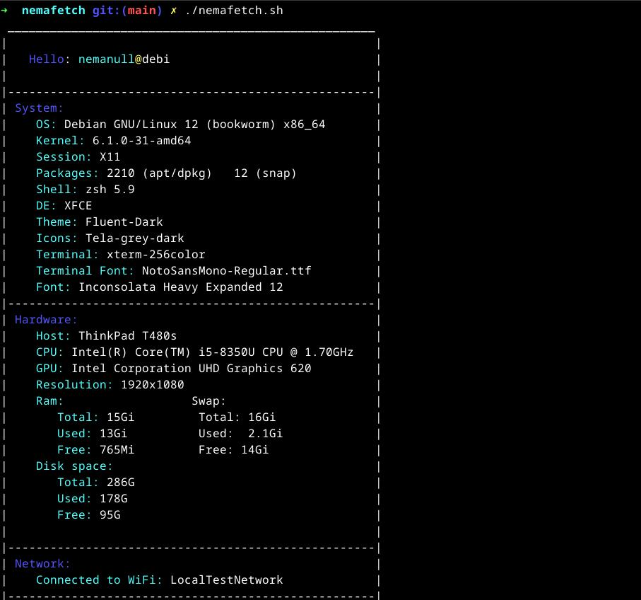

# Nemafetch

Just a slightly updated version of one of my old fetch scripts.

Features

🚀 Displays essential system details (OS, Kernel, Packages, Shell, DE, Theme, Icons, etc.).

🎨 Color-coded output for better readability.

📦 Package manager detection (APT, DNF, Pacman, etc.).

🖥️ Hardware information (CPU, GPU, RAM, Disk usage, Display resolution).

🌐 Network details (WiFi connection, VPN status).

📜 Minimal and efficient Bash script with no dependencies.

### Installation

Clone the Repository

```bash
git clone https://github.com/yourusername/nemafetch.git

cd nemafetch
```

Make it Executable

```bash
chmod +x nemafetch.sh
```

Run Nemafetch


```bash
./nemafetch.sh
```

Optional: Install it System-Wide


To use nemafetch anywhere in the terminal:

```bash
sudo mv nemafetch.sh /usr/local/bin/nemafetch
```

Now you can simply run:

```bash
nemafetch
```

Screenshot: 




# Color theme

## You can modify the color theme and layout by editing the variables in the script:


- COLOR_TITLE="\e[31m"    # Red
- COLOR_SECTION="\e[38;5;237m" # Dark gray
- COLOR_VALUE="\e[33m"    # Yellow
- COLOR_RESET="\e[0m"

Feel free to customize it to match your terminal theme! 🎨

### License

- You are more than welcome to change, modify, and distribute any part of this script. 

### Contribution

Pull requests and suggestions are welcome! If you find a bug or want to add a feature, feel free to open an issue.

### Credits

Developed with ❤️ by nemanull.